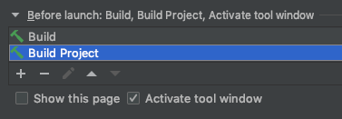

## Trouble Shoot

##### I get `ClassNotFoundException`
* Solution: Locate the missing class library, and add dependency in the main app project.
* It mainly because SpringBoot instantiate bean by `new`, in this case
the class is load by main app classloader that our of our control.

```java
// org.springframework.boot.autoconfigure.data.AbstractRepositoryConfigurationSourceSupport
@Override
public void registerBeanDefinitions(AnnotationMetadata importingClassMetadata, BeanDefinitionRegistry registry,
        BeanNameGenerator importBeanNameGenerator) {
    RepositoryConfigurationDelegate delegate = new RepositoryConfigurationDelegate(
            getConfigurationSource(registry, importBeanNameGenerator), this.resourceLoader, this.environment);
    delegate.registerRepositoriesIn(registry, getRepositoryConfigurationExtension());
}
```

##### I get `ClassCastException`
* Solution: specify class in `plugin.pluginFirstClasses` of `application.yml`
* It's because the class is loaded by mismatch class loader. `spring-boot-autoconfigure`
package referred a lot 3rd party classed directly, which should be loaded
by our `PluginClassloader` in our case. 

##### Irrelevant beans get inject to plugin `ApplicationContext`
* You need to find out which `AutoConfiguration` introduce those
beans, and add it by `getExcluceConfigurations`.
```java
    @Override
    protected SpringBootstrap createSpringBootstrap() {
        return new SharedDataSourceSpringBootstrap(this, MdSimplePluginStarter.class) {
            @Override
            protected String[] getExcludeConfigurations() {
                return ArrayUtils.addAll(super.getExcludeConfigurations(),
                        "graphql.spring.web.servlet.GraphQLEndpointConfiguration");
            }
        }
        .addSharedBeanName("extensionRegisterService");
    }
```

##### Plugin is not compiled after I changed code.
* If you try to run your app with plugin from IDE, mostly the IDE will only
compile the app project/module only. Therefore you have to tell the 
IDE compile everything including plugin code. for IDEA, you could use this 
setting of Run/Debug Configuration:


#####

## Misc.
* Package name cannot start with `org.pf4j`, `java` or `javax`. 
`PluginClassLoader` will treat them differently. 
* Stay in same framework stack as long as you can. Introducing library with complex 
dependencies (link Spring Data JPA) into plugin only, will cause many unexpected
problems. Because plugin and app have different classloader, it's a little
bit hard to mark sure all referred dependent classes are loaded by the same
classloader.